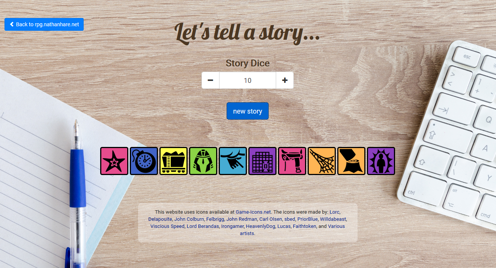

# storygen

## purpose
This project was created to be used for creative story telling. It is meant to 
be an online, accessible version of story dice.

## usage
You can change the amount of icons shown with the plus and minus buttons as 
well as the input box at the top of the page. There is a cap of 99 icons, to 
keep from killing the server. Click the "new story" button to regenerate all of
the icons, and click on an icon to regenerate just that icon.

## screenshot
 

#### Commands to generate icon list
```
cd icons/
printf "%s\',\n\'" * > ../js/icons.js 
```
